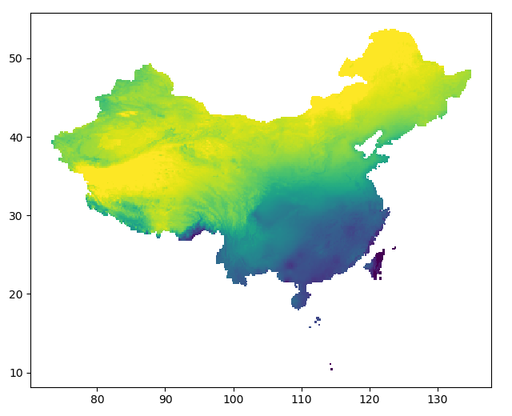
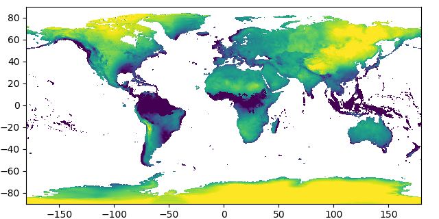
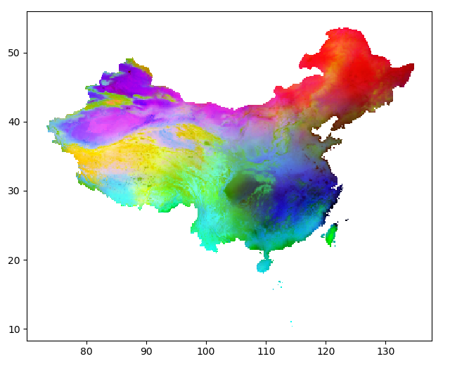

# Mikrubi Graphics

```@contents
Pages = ["graphics.md"]
Depth = 3
```

```@meta
CurrentModule = Graphics
```

## Module introduction

`Graphics` is an accessory module of `Mikrubi`. It illustrates many types of objects involved in `Mikrubi` including shapefile, raster layer, `Mikrubi.CtPixels`, and `MikrubiField` as images, which may be useful while debugging. 

Since the plotting engine is substantially the Python package `matplotlib` (wrapped into Julia by `PyPlot.jl`), `Graphics` is not imported into the main package. When necessary, users may include include this accessory module by the following lines, if Python as well as the Python package `matplotlib` has been installed.
```julia
using Mikrubi
using .Graphics
using PyPlot
setplot(PyPlot)
```

```@docs
showlayer
showfield
showctpixels
showshptable
```

## The example of *Allium wallichii*

In the beginning, here we get the packages, path strings, and decoration functions ready:

```julia
using Mikrubi
using .Graphics
using PyPlot
setplot(PyPlot)

shpfile = "path/to/china/counties.shp";
layerdir = "path/to/worldclim/layers";
countylist = "path/to/occupied/county/list.txt";

largeaxis() = gca().set_position([0.06, 0.07, 0.9, 0.9])
worldwide() = (xlim(-180, 180); ylim(-90, 90))
```

### Illustrating the shapefile and the raw layers

Now the workflow is disassembled into steps, and we use functions implemented in `Graphics` to check the outputs.

First of all, a shapefile is read into Julia. We can see clearly that the boundaries of counties of China plotted in black line.

```julia
shptable = readshape(shpfile)

figure(figsize=(6.4, 6.4))
showshptable(shptable)
largeaxis()
savefig("shpfile.png")
close()
```


Then, a series of WorldClim climatic factor layers are read in, and the first layer among them is illustrated.

```julia
layers = readlayers(layerdir)

figure(figsize=(6.4, 3.2))
set_cmap("viridis")
showlayer(layers[1])
largeaxis()
worldwide()
savefig("rawlayer1.png")
close()
```


### Illustrating the rasterization

Later, counties are rasterized using the grid defined by the layers. Every exclusive pixel is assigned the characteristic color of the county it belongs to, while pixels shared by multiple counties are dyed composite (thus always darker) colors.

```julia
ctpixels = rasterize(shptable, layers[1])

figure(figsize=(6.4, 6.4))
showctpixels(ctpixels, layers[1])
showshptable(shptable, lw=0.5)
gca().set_aspect("auto")
largeaxis()
savefig("ctpixels.png")
```


Zoom in, and details of the rasterization result are clearer.

```julia
xlim(88, 98)
ylim(30, 40)
savefig("ctpixels2.png")
close()
```


### Illustrating the extracted layers and the Mikrubi field

Then, a Mikrubi field is constructed from the results above. Notable, `layers` lie in the input argument list at both the first and the third places. Layers at the first place are masked by the rasterization result and transformed into fewer (by default, three) layers by principal component analysis, and the results are finally assigned to `ylayers` here. Meanwhile, layers at the third place undergo the same processes but no masking is applied, whose results are assigned to `gylayers`. 

Now check the images of `ylayers[1]` and `gylayers[1]` under the same `clim`, and we can see that they are actually identical on their overlapping part — because they are derived from the same input layers and have experienced the same operations.

```julia
field, ylayers, gylayers = makefield(layers, ctpixels, layers)

figure(figsize=(6.4, 5.2))
showlayer(ylayers[1])
gca().set_aspect("auto")
largeaxis()
clim(-6, 2)
savefig("pcalayer1.png")
close()
```



```julia
figure(figsize=(6.4, 3.2))
set_cmap("viridis")
showlayer(gylayers[1])
largeaxis()
worldwide()
clim(-6, 2)
savefig("gpcalayer1.png")
close()
```



At the same time, we may check the Mikrubi field just obtained visually in RGB space (skewed by `f = tiedrank` in `showfield` for better image representation). Parts of China are dyed different colors, and the pattern does coincide with our knowledge.

```julia
figure(figsize=(6.4, 5.2))
showfield(field, layers[1])
gca().set_aspect("auto")
largeaxis()
savefig("field.png")
close()
```



### Illustrating the predictions

Finally it is the fitting and the predictions. Since the model here is in high dimensionality beyond imagination, we turn to check the images of the predictions. Analogously, under the same `clim` values, the predicted regional distribution (`geodist`) and the predicted global distribution (`ggeodist`) are identical over their overlapping area. Using graphics, we can confirm that everything is in accordance with expectation.

```julia
ctlist = readlist(countylist)
model = fit(field, ctlist)
geodist = predict(ylayers, model)

figure(figsize=(6.4, 5.2))
set_cmap("CMRmap")
showlayer(geodist, f = x -> x ^ 0.35)
gca().set_aspect("auto")
largeaxis()
clim(0, 0.45)
savefig("geodist.png")
close()
```


```julia
ggeodist = predict(gylayers, model)

figure(figsize=(6.4, 3.2))
set_cmap("CMRmap")
showlayer(ggeodist, f = x -> x ^ 0.35)
largeaxis()
worldwide()
clim(0, 0.45)
savefig("ggeodist.png")
close()
```


