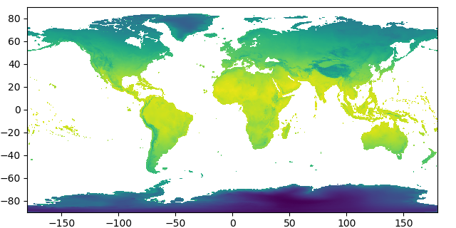

# Graphics

```@contents
Pages = ["graphics.md"]
Depth = 4
```

```@meta
Module = Mikrubi
```

Objects in Mikrubi of various types (shape files, rasters, raster stacks, `Mikrubi.CtPixels` instances, Mikrubi fields) can be plotted by Plots or by PyPlot. 

## Plotting with Plots

After loading the Plots package, the objects can be plotted by `plot` or `plot!`. 

### Example of *Prinsepia utilis*

Here we use the distribution of *Prinsepia utilis* (Rosaceae) in Nepal as an example. First we get all the objects prepared.

```julia
using Mikrubi
using Plots
import GADM
import RasterDataSources; const RDS = RasterDataSources

shppath = GADM.download("NPL")

get!(ENV, "RASTERDATASOURCES_PATH", tempdir())
RDS.getraster(RDS.WorldClim{RDS.BioClim}, res="10m")
climpath = RDS.rasterpath(RDS.WorldClim{RDS.BioClim})
```

#### Illustrating the shape file

The variable `shptable`, what is read through [`readshape`](@ref), called a shape file here, can be `plot`ted.

```
shptable = readshape(shppath, 1);

plot(shptable)
savefig("plots_shptable.png")
```


#### Illustrating the raster layers

We read the WorldClim raster `layers`, and extract the first raster `layer` from the stack, and then `plot` it.

```julia
layers = readlayers(climpath)
layer = first(layers)

plot(layer)
savefig("plots_layer.png")
```


#### Illustrating the rasterization result

Here `ctpixels` is the object storing the rasterization result, although in many cases the result is hidden in [`makefield`](@ref). 

```julia
ctpixels = rasterize(shptable, layer);

plot(ctpixels)
savefig("plots_ctpixels.png")
```


#### Illustrating the Mikrubi field

A Mikrubi field cannot be `plot`ted solely, because it does not contain enough information for illustrating. It must follow the corresponding raster grid in the argument list.

```julia
field, ylayers = makefield(layers, shptable);

plot(layer, field)
savefig("plots_field.png")
```


## Plotting with PyPlot

Since the PyPlot plotting engine is substantially the wrapped Python package `matplotlib`, users who wish to use PyPlot have to manually install the package, and then tell Mikrubi to use it by the following lines.

```julia
using PyPlot
setplot(PyPlot)
```

Four functions are provided to illustrate the objects of different types.

```@docs
showshptable
showlayer
showfield
showctpixels
```

### Example of *Allium wallichii*

In the beginning, here we get the packages, path strings, and decoration functions ready:

```julia
using Mikrubi
using PyPlot
setplot(PyPlot)

shppath = "path/to/china/counties.shp";
climpath = "path/to/worldclim/layers";
ctlistpath = "path/to/occupied/county/list.txt";

largeaxis() = gca().set_position([0.06, 0.07, 0.9, 0.9])
worldwide() = (xlim(-180, 180); ylim(-90, 90))
```

#### Illustrating the shape file and the raw layers

Now the workflow is disassembled into steps, and we check the outputs by illustrating them.

First of all, a shape file is read into Julia. We can see clearly that the boundaries of counties of China plotted in black line.

```julia
shptable = readshape(shppath)

figure(figsize=(6.4, 6.4))
showshptable(shptable)
largeaxis()
savefig("pyplot_shptable.png")
close()
```


Then, a series of WorldClim climatic factor layers are read in, and the first layer among them is illustrated.

```julia
layers = readlayers(climpath)

figure(figsize=(6.4, 3.2))
set_cmap("viridis")
showlayer(first(layers))
largeaxis()
worldwide()
savefig("pyplot_rawlayer1.png")
close()
```



#### Illustrating the rasterization result

Later, counties are rasterized using the grid defined by the layers. Every exclusive pixel is assigned the characteristic color of the county it belongs to, while pixels shared by multiple counties are dyed composite (thus always darker) colors.

```julia
ctpixels = rasterize(shptable, first(layers))

figure(figsize=(6.4, 6.4))
showctpixels(ctpixels, first(layers))
showshptable(shptable, lw=0.5)
gca().set_aspect("auto")
largeaxis()
savefig("pyplot_ctpixels.png")
```


Zoom in, and details of the rasterization result are clearer.

```julia
xlim(88, 98)
ylim(30, 40)
savefig("pyplot_ctpixels2.png")
close()
```


#### Illustrating the extracted layers and the Mikrubi field

Then, a Mikrubi field is constructed from the results above. Notable, `layers` lie in the input argument list at both the first and the third places. Layers at the first place are masked by the rasterization result and transformed into fewer (by default, three) layers by principal component analysis, and the results are finally assigned to `elayers` here. Meanwhile, layers at the third place undergo the same processes but no masking is applied, whose results are assigned to `eplayers`. 

Now check the images of `first(elayers)` and `first(eplayers)` under the same `clim`, and we can see that they are actually identical on their overlapping part — because they are derived from the same input layers and have experienced the same operations.

```julia
field, elayers, eplayers = makefield(layers, ctpixels, layers)

figure(figsize=(6.4, 5.2))
showlayer(first(elayers))
gca().set_aspect("auto")
largeaxis()
clim(-6, 2)
savefig("pyplot_pcalayer1.png")
close()
```


```julia
figure(figsize=(6.4, 3.2))
set_cmap("viridis")
showlayer(first(eplayers))
largeaxis()
worldwide()
clim(-6, 2)
savefig("pyplot_gpcalayer1.png")
close()
```


At the same time, we may check the Mikrubi field just obtained visually in RGB space (skewed by `f = tiedrank` in `showfield` for better image representation). Parts of China are dyed different colors, and the pattern does coincide with our knowledge.

```julia
figure(figsize=(6.4, 5.2))
showfield(field, first(layers))
gca().set_aspect("auto")
largeaxis()
savefig("pyplot_field.png")
close()
```


#### Illustrating the predictions

Finally it is the fitting and the predictions. Since the model here is in high dimensionality beyond imagination, we turn to check the images of the predictions. Analogously, under the same `clim` values, the predicted regional distribution (`geodist`) and the predicted global distribution (`ggeodist`) are identical over their overlapping area. Using graphics, we can confirm that everything is in accordance with expectation.

```julia
ctlist = readlist(ctlistpath)
model = fit(field, ctlist)
geodist = predict(elayers, model)

figure(figsize=(6.4, 5.2))
set_cmap("CMRmap")
showlayer(geodist, f = x -> x ^ 0.35)
gca().set_aspect("auto")
largeaxis()
clim(0, 0.45)
savefig("pyplot_geodist.png")
close()
```


```julia
ggeodist = predict(eplayers, model)

figure(figsize=(6.4, 3.2))
set_cmap("CMRmap")
showlayer(ggeodist, f = x -> x ^ 0.35)
largeaxis()
worldwide()
clim(0, 0.45)
savefig("pyplot_ggeodist.png")
close()
```


